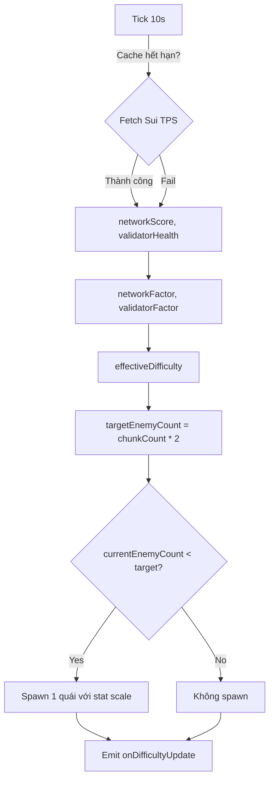

# Enemy System & Dynamic Difficulty

## Mục tiêu
- Điều chỉnh spawn quái theo độ khó map và tải mạng Sui theo thời gian thực.
- Giữ số quái hiện tại sát mức mục tiêu (`targetEnemyCount`) mà không spam.

## File liên quan
| File | Chức năng |
| --- | --- |
| `src/game/enemyMaintainer.ts` | Tính network score, độ khó hiệu dụng và gọi callback spawn |
| `src/game/start.ts` | Cài đặt maintainer, spawn quái ban đầu, combat loop |
| `src/pages/GamePage.jsx` | Nhận event `game:difficulty-update`, hiển thị UI |

## Dữ liệu đầu vào
- Map: `difficulty` (1-9), `chunkCount` (nếu không có sẽ tính từ diện tích map với `CHUNK_SIZE=5`).
- On-chain: chỉ dùng `getTotalTransactionBlocks` để suy ra TPS; `validatorHealth` đang cố định 100.

## Logic EnemyMaintainer (code hiện tại)
1. `start(interval=10000ms)` gọi `checkAndMaintain` ngay và lặp theo interval.
2. Cache network trong 30s; chỉ fetch RPC khi hết hạn cache và không có fetch đang chạy.
3. `networkScore` = clamp 0-100 của `(TPS / 100) * 100` với TPS lấy từ delta `getTotalTransactionBlocks` và delta thời gian.
4. `validatorHealth` mặc định 100; `validatorStatus`/`networkStatus` map theo score (Quiet/Normal/Busy/Very Busy).
5. `effectiveDifficulty = min(9, baseDifficulty * networkFactor * validatorFactor)`  
   - `networkFactor = 0.8 + (networkScore/100)*0.4` (0.8→1.2)  
   - `validatorFactor = 0.9 + (validatorHealth/100)*0.2` (0.9→1.1)
6. `targetEnemyCount` hiện đang cố định `chunkCount * 2` (đã clamp tối thiểu 1). Giá trị tính từ `enemiesPerChunk` trong constructor bị override bởi bước này.
7. Nếu `currentEnemyCount < targetEnemyCount` thì spawn thêm đúng 1 quái mỗi chu kỳ.

### Flow tóm tắt (maintainer)


### Bảng trạng thái mạng/validator
| Score | Network status | Validator status |
| --- | --- | --- |
| 0-24 | Quiet | Critical/Warning tùy 0-39 |
| 25-49 | Normal | Warning (40-59) |
| 50-74 | Busy | Good (60-79) |
| 75-100 | Very Busy | Healthy (80-100) |

## Thống kê base và scale (từ code)
- Base stat theo `baseDifficulty` (normalize về 1-9):
  - `hp = 2 + round(norm * 12)`
  - `damage = 5 + round(norm * 18)`
  - `speed = 30 + round(norm * 25)`
  - `enemiesPerChunk = 0.5 + norm * 3.5` (chỉ dùng cho target ban đầu trong constructor).
- Khi spawn, stat gửi vào callback = `baseStat * (effectiveDifficulty / baseDifficulty)` (làm tròn lên).

## Spawn trong scene (`start.ts`)
- Số quái ban đầu: `enemiesPerChunk = 0.3 + (baseDifficulty - 1) * 0.15`, spawn goblin = `chunkCount * enemiesPerChunk` (tối thiểu 1), yod ≈ một nửa goblin.
- Maintainer nhận `baseDifficulty`, `chunkCount`, callback `onSpawnEnemy` (1/3 spawn yod) và `onDifficultyUpdate`.
- UI event: `game:difficulty-update` được dispatch với `detail` gồm `baseDifficulty`, `effectiveDifficulty`, `networkScore`, `validatorHealth`, `networkStatus`, `validatorStatus`, `targetEnemyCount`, `currentEnemyCount` (đếm thực tế trên map).
- Spawn mới cách player ít nhất 4 tiles.

## Cách dùng nhanh
```typescript
import {
  initEnemyMaintainer,
  stopEnemyMaintainer,
  EnemyConfig,
  DifficultyInfo,
} from "./enemyMaintainer";

const maintainer = initEnemyMaintainer({
  rpcUrl: "https://fullnode.testnet.sui.io:443",
  baseDifficulty: 3,
  chunkCount: 5,
  onSpawnEnemy: (config: EnemyConfig) => {
    spawnGoblin(x, y, config.baseHp, config.baseDamage, config.baseSpeed);
  },
  onDifficultyUpdate: (info: DifficultyInfo) => {
    console.log(`Difficulty: ${info.effectiveDifficulty.toFixed(2)}`);
  },
});

maintainer.updateEnemyCount(3); // gọi khi quái chết hoặc spawn tay
maintainer.start(10000);        // bật vòng lặp (10s)
// ...
stopEnemyMaintainer();          // khi scene kết thúc
```

## Ghi chú
- Mỗi chu kỳ chỉ spawn 1 quái nếu thiếu để tránh spam.
- Network yếu làm tăng `effectiveDifficulty` và stat quái (theo tỉ lệ), nhưng target hiện fix = `chunkCount * 2`.
- Nếu cần thay đổi mục tiêu spawn linh hoạt, chỉnh trong `checkAndMaintain()` thay vì cố định `chunkCount * 2`.
