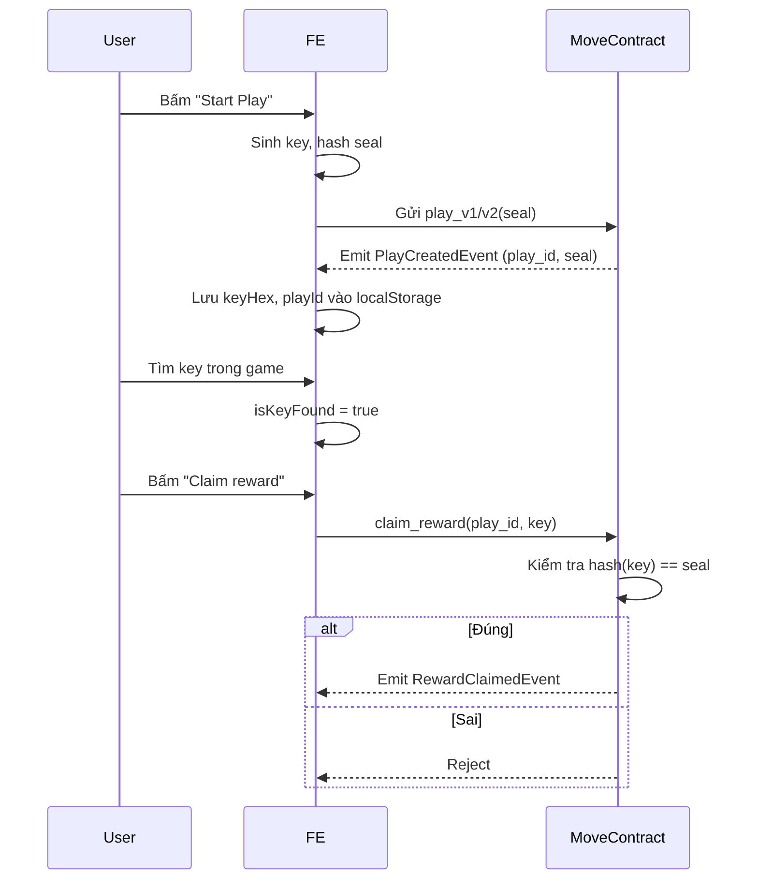

# Chunk Adventure - Play & Claim Flow

## 1. Tổng quan

Luồng play/claim sử dụng key bảo mật, chỉ lưu local, blockchain chỉ lưu hash (seal).  
Nếu mất key (chưa claim), không thể lấy lại reward.

---

## 2. Flow chi tiết

### A. Play (Bắt đầu chơi)

1. **FE sinh key ngẫu nhiên** (16 bytes), hash thành `seal`.
2. **Gửi transaction** gọi `play_v1` hoặc `play_v2`:
   - Tham số: `world`, `reward_vault`, `character`, (coin nếu v2), `seal`
3. **Contract tạo Play event**:
   - Lưu `play_id`, `creator`, `seal`, `world_id`, min/max reward...
4. **FE lưu key gốc (keyHex) vào localStorage** cùng playId, worldId.

---

### B. Tìm key trong game

- FE ẩn key tại 1 tile ngẫu nhiên trên map.
- User phải điều khiển nhân vật tìm đúng tile để "nhặt" key.
- Khi nhặt key, FE set `isKeyFound = true`.

---

### C. Claim reward

1. User bấm "Claim reward":
   - FE lấy lại keyHex từ localStorage.
   - Gửi transaction gọi `claim_reward`:
     - Tham số: `world`, `reward_vault`, `random_object`, `play_id`, `key`
2. **Contract kiểm tra**:
   - Hash(key) == seal đã lưu?
     - Đúng: phát thưởng, emit `RewardClaimedEvent`.
     - Sai: reject.

---

### D. Khôi phục session

- Nếu reload/lỗi, FE lấy lại playId, keyHex từ localStorage.
- Nếu đổi máy, user phải nhập lại playId + keyHex đã backup.
- FE có thể fetch danh sách play chưa claim từ on-chain (qua event), nhưng **không thể lấy lại key nếu mất**.

---

### E. Kiểm tra đã claim chưa

- FE query event `RewardClaimedEvent` với playId để biết đã claim chưa.

---

## 3. Các hàm chính trong FE

- **handlePlayOnChain**: Sinh key, gửi play tx, lưu key vào localStorage.
- **handleClaimOnChain**: Lấy key từ localStorage, gửi claim tx.
- **fetchUnclaimedPlays**: Lấy danh sách play chưa claim từ on-chain.
- **retryFetchPlayId**: Lấy lại playId nếu tx chưa được index.
- **Restore Session Modal**: Cho phép nhập lại playId + keyHex nếu đổi máy.

---

## 4. Lưu ý bảo mật

- Key chỉ lưu local, blockchain chỉ lưu hash.
- Mất key = mất quyền claim vĩnh viễn.
- Nên hướng dẫn user backup key khi play.

---

## 5. Flow diagram

---

## 6. Restore session (đổi máy)

- FE fetch danh sách play chưa claim từ on-chain.
- User nhập lại keyHex đã backup để claim.
